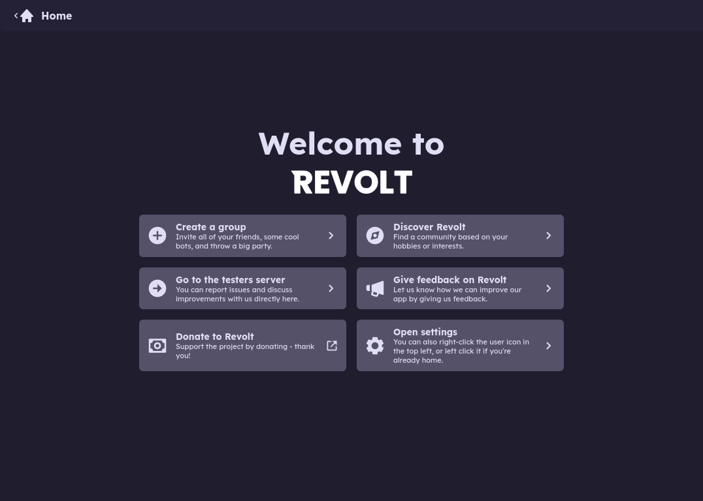
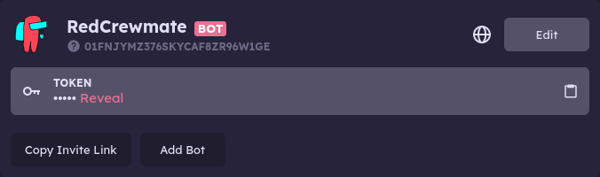

Creating a Bot
--------------

When you open revolt you will be faced with this screen:

Click on the "Open Settings" button on the bottom right to open the settings menue, you'll be faced with *you guessed it* the settings menue, what we're really looking for however is the side bar which should look something like this:

.. image:: ../assets/setting_menue.png
    :alt: Revolt Settings Menue

Next we click on the "My Bots" button, aka this one:

Now press the "Create a Bot" button, yes the wide imposing one at the top of the screen with "Create a Bot" written on it if you couldn't guess.

You'll be prompted with a prompt that asks for your preferred username (for the bot ofc) which looks something like this:

.. image:: ../assets/bot_username_prompt.png
    :alt: Bot Username Prompt

Enter your desired username and you'll have something like this:

For the sake of this tutorial I'm just going to use my pre-existing bot aka RedCrewmate (yeah, we do Among Us jokes here).

.. note::

    You can press the "Edit" button to change the bot's profile, banner and such but I'll leave that to you to figure out ;)

    All you really need from this page from the point forward is the token so copy that bad boy and we'll paste it in a moment.

Congratulations, you've created a bot account, wooooo!

Now to actually make it do stuff.
